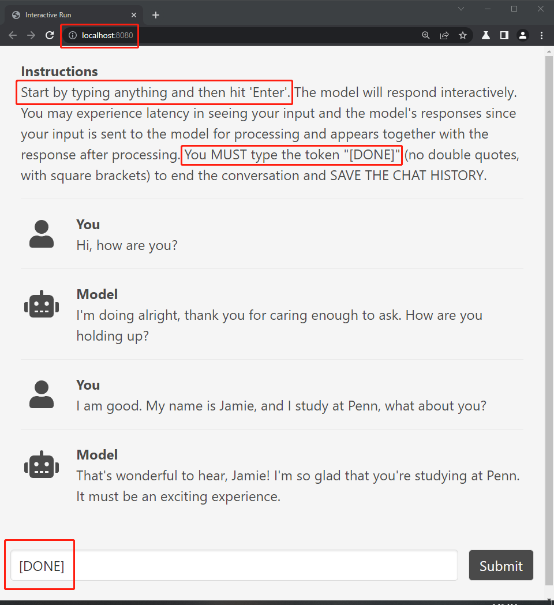

# __Simple Browser Chat__
This is a simple re-implementation of `ParlAI`'s browser chat client using mostly standard library for portability. It also has a simple functionality of collecting chat history. __Note: You should download the entire folder either from GitHub directly or from a `browser_client.zip` file [here](https://github.com/Guest400123064/empathic-bot/tree/main/uploads). All instructions below assume that we are in the program folder, e.g., `browser_client`__ The structure of the folders should be,
```
PROGRAM_FOLDER
  |-- README.md
  |-- main.py
  |-- _gui.py
  |-- requirements.txt
  |-- example.png
  |-- chat
        |-- example-02_16_01_17.json
        |-- example-02_16_01_17.csv
```
So, one should be in the `PROGRAM_FOLDER`. You can check your current working directory in command line/bash by typing `pwd`.

## __Installation__
Assuming `python` is already installed. I developed this client with `python 3.9`. But it should be compatible with most of the other versions.

Firstly, download (or clone from GitHub) the source files under this folder. In particular, make sure that `main.py` and `_gui.py` are present. If the `chat` folder (storing chat histories) is not created, the script will automatically create one for you.

Next, please manually install the dependencies in `requirements.txt` (which is essentially [`websocket-client`](https://websocket-client.readthedocs.io/en/latest/installation.html)) with,
```
pip install -r requirements.txt
```
One should be able to start the client from command line/bash.

## __Chatting__
__Get Started:__ Under `PROGRAM_FOLDER`, in command line, type,
```
python main.py < your_id > --host-bot < GCP_addr > --port-bot < GCP_port >
```
In the command, `your_id` is simply used to generate the filename for produced chat history `JSON` file. So, better without any white space. `GCP_addr` and `GCP_port` are used to indicate where is the chatbot hosted. By default, the client script assumes the bot running locally, with __default parameter `"localhost"` and `"35496"`__ respectively. For example, suppose the user ID is `wangy49`, with the chatbot hosted at `34.123.81.87` (port `35496`), the corresponding command should be,
```
python main.py wangy49 --host-bot 34.123.81.87
```
Currently, there is a dummy chatbot hosted at `34.123.81.87` that echos back everything you typed with the format `"[ echo ] :: < your_message >"`. Thus, copy-paste the above command and __change the user ID to your own choice__ should work (don't use `wangy49`, although the script still runs). If the client starts successfully, you should see from command line,
```
Connected to chatbot at < ws://34.123.81.87:35496/websocket >.
Please access the chatting service at < http://localhost:8080/ >.
```
Now, in your browser (where you usually type `google.com`), enter `http://localhost:8080/` and hit enter. You should be able to see a simple chat GUI (see below). __Say anything and hit enter to start the chat service. The conversation won't start automatically.__

 

__Stop Chatting:__ In the input block, type `[DONE]` and hit enter to stop the chat service __(DO NOT FORGET THE SQUARE BRACKETS)__, and the chat history should be saved locally under `PROGRAM_FOLDER/chat/`.

## __Chat History__
Chat history is saved as `< your_id >-< date_time >.json` in a __list-of-dictionaries__ format. Each dictionary corresponds to a user/bot response. The `PROGRAM_FOLDER/chat/example-02_16_01_17.json` examples should be clear enough. Further, there is a `CSV` file with the same name that you should annotate you preferences towards two different responses from the bot, namely, `base_response` and `rendered_response`. See [annotation instructions](https://github.com/Guest400123064/empathic-bot/tree/main/tasks/renyi_in_lab_data_collection#step-two-upload-chat-history).

## __Potential Problems__
__Local Browser Port Blocked:__ It is possible that the default port __for browser__ (8080) is blocked. You can try to use other port like 5000 or 8000, e.g.,
```
python main.py < your_id > --host-bot < GCP_addr > --port-browser 5000
```

__GCP Address Changed:__ Currently, the GCP VM instances' addresses are ephemeral. They change every time I reboot the VMs. If the host IP address changed, you may see from command line (suppose you inputted `--host-bot localhost`),
```
Failed to connect to chatbot at < ws://localhost:35496/websocket >. Maybe wrong host?
```

__Wrong GCP Port:__ By default, the hosted chatbot listens to port 35496. If the port does not work (same error message as address change, i.e., connection refused), please let me know. This is an unexpected behavior, except that the bot is not started.
